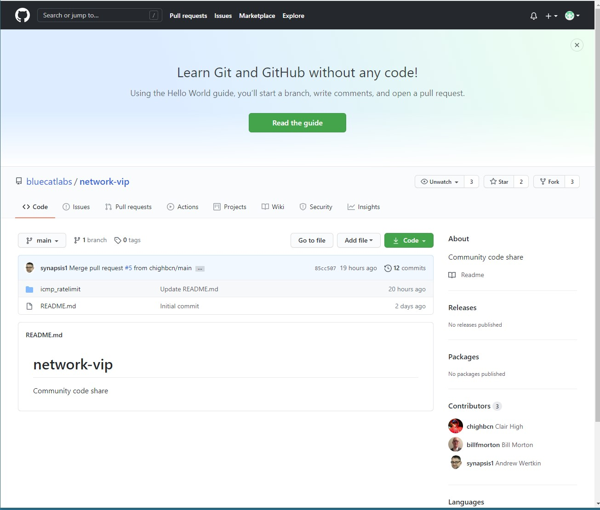

# Adventures in Automation

This repo section is half blog, half tutorial, and half practices that work for me (notice that you are getting 1.5 for the price of 1.0 - a bargain!).  Opinions are mine, experiences are mine - your mileage may vary or conflict.  Happy to discuss, will not *argue* about it.

## Who can benefit from this

Hopefully everyone from the 'just getting started' to the 'seasoned, I have the bloody t-shirt' crowds will glean some gems.  In any case, you will decide the value.

## Why do this

Well, mostly because I never trained as a developer and my experiences getting help/tutelage from developers generally ended badly or with a great deal of frustration on my part.
"I wish someone could have just explained this to me so I did not have spend 3 days doing goggle searches and running down blind alleys.  It's really not that hard..."

If I can smooth out some of the road or help someone go faster, mission accomplished.

## Tooling

This is always a controversial topic.  There is always a disciple or (worse!) zealot that expounds on the reasons why their favorite tool is the **BEST**.  The worst ones will provide scorn for all other choices.

**BLUF** (bottom line up front) - ***pick the tools that work for <ins>you</ins> and get the job done.***

Be prepared, few tools last forever.  Some die of neglect, some are superceded, some fall out of favor.

I'm not an OS zealot either - I *like* linux, work with Windows, and ignore Apple.  I tend to gravitate to tooling that works across OS platforms so it doesn't matter if I'm on my work laptop (Windows) or one of my linux instances (home).

### Integrated Development Environment (IDE)

IDEs provide you interfaces to enter code and typically have additional functions to support a development activity.  The functionality is typically a text editor with plugins (or equivalent) for things like source control, debuggers, documentation libraries, etc.

My current recommendation for beginners thru advanced is [Visual Studio Code](https://code.visualstudio.com/).  It offers extensive language and tool integration support, including linting, for a long list of languages and file formats.  It is also actively maintained and improvements show no sign of slowing down.  Spoiler alert - I'm writing this using VSCode and leveraging MarkDown extensions to check my syntax.

```text

linting is a function that does language/format static code checking for syntax and style (in some cases).  Hugely beneficial unless you like chasing "invalid syntax" errors.

```

### Source Control

Whether you are writing short scripts for yourself or large projects with others contributing code, source control is important to get in the habit of using.  It will save you in the end - being able to look back at different versions, comparing your upcoming changes, or working with a team.  Once you start using it, you will find it does not impede you or otherwise get in the way.

Consider: you've created a script to apply a fix to a workstation.  You've tested it, it works great, and now you're using in your production environment.  Bouyed by your success, you expand your script to fix three more issues and handle two corner cases over the next six months.  Also during that time, several co-workers have started to use your script.  You get a call from one of them with reports that your script is not working.  You spend some time troubleshooting with them only to discover that they are using an old version of your script!  First identifying that fact won't necessarily be evident, and second, how do you fix that going forward?

With source control, the situation would have had a chance of not even occuring - your co-workers should be using the current released version and should be notified when a new version is available.  Additionally, you could even compare the version they are using with the current version to understand what is happening in their particular situation.

So, off the soap box and on to how you can use source control effectively.  In this entry we'll discuss a popular source control called Github.  It also happens to be the Network-VIP repository so it will allow you to participate with your fellow nVIP'ers.

Off we go!

If you don't have a Github account yet, get one asap.  https://github.com and follow the "Sign up" prompts.  As easy as you can get.

Install the Github Desktop app on your local machine (flavor is up you) [Github Desktop](https://desktop.github.com/)

Next, you'll want to increase your vocabulary by reading the [Hello World](https://guides.github.com/activities/hello-world/).  Be farewarned - it's an intro and covers the basics of managing your own personal repositories.  We'll go over some of the terminology and add the additional items you'll need to know/understand about working with a community of users.

* Repository - A repository is the most basic element of GitHub. They're easiest to imagine as a project's folder. A repository contains all of the project files (including documentation), and stores each file's revision history.
  * Remote Repository - a repo on a server
  * Clone - A clone is a copy of a repository that lives on your computer instead of on a website's server somewhere, or the act of making that copy. When you make a clone, you can edit the files in your preferred editor and use Git to keep track of your changes without having to be online. The repository you cloned is still connected to the remote version so that you can push your local changes to the remote to keep them synced when you're online.

* Fork - A fork is a personal copy of another user's repository that lives on your account. Forks allow you to freely make changes to a project without affecting the original upstream repository. You can also open a pull request in the upstream repository and keep your fork synced with the latest changes since both repositories are still connected.

* Branch - A branch is a parallel version of a repository. It is contained within the repository, but does not affect the primary or main branch allowing you to work freely without disrupting the "live" version. When you've made the changes you want to make, you can merge your branch back into the main branch to publish your changes.

* Commit - A commit, or "revision", is an individual change to a file (or set of files). When you make a commit to save your work, Git creates a unique ID (a.k.a. the "SHA" or "hash") that allows you to keep record of the specific changes commited along with who made them and when. Commits usually contain a commit message which is a brief description of what changes were made.

* Push - To push means to send your committed changes to a remote repository on GitHub.com. For instance, if you change something locally, you can push those changes so that others may access them.

* Pull Request/Merge - Pull requests are proposed changes to a repository submitted by a user and accepted or rejected by a repository's collaborators. Like issues, pull requests each have their own discussion forum.

* Review - Reviews allow others with access to your repository to comment on the changes proposed in pull requests, approve the changes, or request further changes before the pull request is merged.

All greek, right?  Well, no fear, we'll walk thru a full example - in fact we're going to use this Adventures in Automation project to demonstrate a common workflow and the steps to achieve.  Note that using Git (what Github is built on) has multiple ways to get the job done and what I'm demonstrating is how I use it.  If you prefer an all commandline workflow - it's there.  You can also do combinations - whatever works for you as long as it gets done.

Right now, this project exists as just a folder on my local machine and one <span>README.md</span> (we'll talk about MarkDown and READMEs in a later topic).

1. Open a browser and go to [Github network-vip repo](https://github.com/bluecatlabs/network-vip).  Login with your github account...

2. You'll want to Fork a copy of the repo to your github account - click the Fork button

you should land in your Github account with a "fork" or copy of the network-vip repo.  "jmacy-cern" is my account name, so you should see *your* account name instead.

3. Now, you want to do work on the repo so we will Clone it to your local machine.  Click on Code and select "Open with Github Desktop"

This will open your Desktop client and prompt you to complete the clone.  Generally the defaults already filled in are sufficient.

Click Clone.  It should leave you in the Desktop client at your cloned repo

4. At this point, from a source control standpoint, I'm ready to do some work.  In this case, I'm going to create a Branch to add the Adventures in Automation files.


Click on New Branch


Once I have my branch defined, I need to update from my clone to my forked network-vip project - you do that with Publish


And finally! I'll add the files I've been collecting to my clone


5. Commit my changes by filling out the Summary and Description, Click on Commit

6. I now need to update my fork with the changes, click on Push origin
My fork has my branch and contents on the Remote (Github).  Next up is getting it merged into the main repo
7. Create a Pull Request

So, you may have noticed something about the above workflow...you never saw me use the integrated Git functionality in VSCode, right?  For me that is just a personal choice.  On initial release, Git functionality in VSCode was pretty limited and I already had a workflow that worked for me so I haven't changed it.  As well, not every IDE or tool I've used has had direct integration, so sticking to my established workflow serves me no matter what I'm doing or using at a given time.